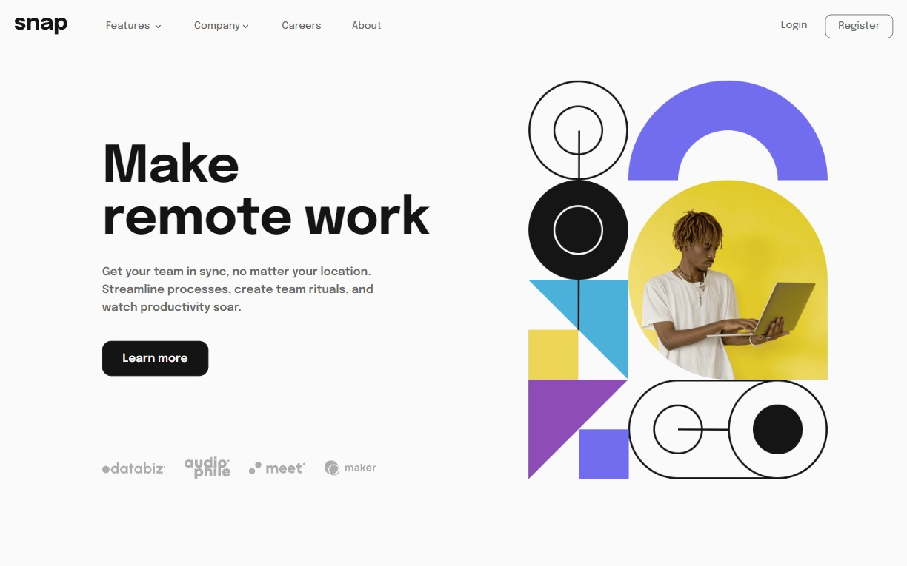

# Frontend Mentor - Intro section with dropdown navigation solution

This is a solution to the [Intro section with dropdown navigation challenge on Frontend Mentor](https://www.frontendmentor.io/challenges/intro-section-with-dropdown-navigation-ryaPetHE5). Frontend Mentor challenges help you improve your coding skills by building realistic projects.

## Table of contents

- [Overview](#overview)
  - [The challenge](#the-challenge)
  - [Screenshot](#screenshot)
  - [Links](#links)
- [My process](#my-process)
  - [Built with](#built-with)
  - [What I learned](#what-i-learned)
  - [Useful resources](#useful-resources)
- [Author](#author)

## Overview

### The challenge

Users should be able to:

- View the relevant dropdown menus on desktop and mobile when interacting with the navigation links
- View the optimal layout for the content depending on their device's screen size
- See hover states for all interactive elements on the page

### Screenshot

### Links

- Solution URL: [GitHub Repo](https://github.com/kemenyfa-szu/frontendmentor-029-remotework)
- Live Site URL: [GitHub Pages](https://kemenyfa-szu.github.io/frontendmentor-029-remotework)

## My process

### Built with

- Semantic HTML5 markup
- CSS custom properties
- Flexbox
- CSS Grid
- Mobile-first workflow
- [Angular](https://angular.io/) - JS framework

### What I learned

- Responsive and accessible navigation bar
  - Collapsing hamburger menu on mobile screens
  - Always visible on larger screens
- Angular
  - Create and use custom directives
  - Angular's way on creating eventhandlers
  - Input&Output binding
  - Subcribing
  - OnDestroy

### Useful resources

- [Coder Coder yt channel](https://www.youtube.com/@TheCoderCoder) - This helped me to create and understand responsive accessible hamburger menus.
- [Monsterlessons Academy yt channel](https://www.youtube.com/@MonsterlessonsAcademy) - This helped me to understand Angular in general and create custom directives (to handle click outside events to close submenus)

## Author

- Frontend Mentor - [@kemenyfa-szu](https://www.frontendmentor.io/profile/kemenyfa-szu)
